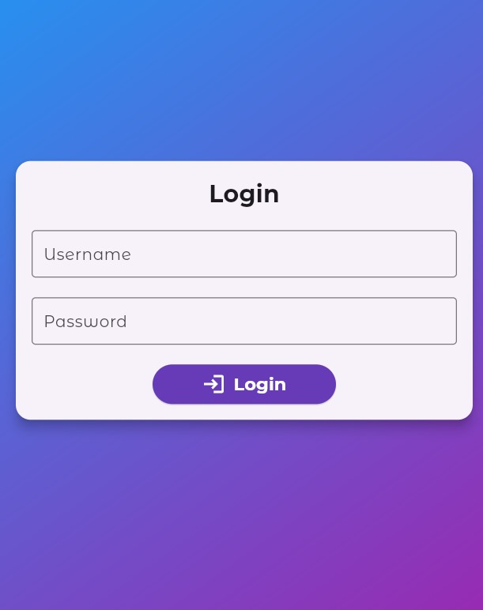

# Smart Home Lighting System

A Flutter-based Smart Home Lighting System that allows users to control the lighting in their home. This app provides a user-friendly interface to turn lights on or off, set timers for automatic lighting control, and manage user authentication. The system is integrated with Firebase for real-time data synchronization.

## Features

- **User Authentication**: 
  - Login page for secure access.
  - Add and manage multiple users.
  - Logout functionality.

- **Light Control**:
  - Turn lights on and off from the app.
  - Set timers to automatically turn lights on or off at specified times.

- **Real-Time Updates**:
  - Integration with Firebase for real-time database updates.
  - Changes made by one user are instantly reflected for others.

## Screenshots


*Login Screen*


*Home Screen*


*Select Room Screen*


*Bedroom Screen*


*Kitchen Screen*


*Living Room Screen*


*Set Timer Screen*

## Installation

1. **Clone the repository**:
   ```bash
   git clone https://github.com/yourusername/smart-home-lighting-system.git

2. **Navigate to the project directory**:
    ```bash
    cd smart-home-lighting-system

3. **Install dependencies**:
    ```bash
    flutter pub get

4. **Configure Firebase**:
    - Set up a Firebase project.
    - Enable Authentication and Realtime Database.
    - Download google-services.json and place it in the android/app directory.
    - Download GoogleService-Info.plist and place it in the ios/Runner directory.

5. **Run the app**:
    ```bash
    flutter run

## Usage

1. **Login**: Enter your credentials to access the system.

2. **Control Lights**:
    - Use the interface to turn lights on or off.
    - Set a timer for automatic control.

3. **Manage Users**: Add new users or logout when finished.

## Firebase Configuration

This project uses Firebase for authentication and real-time database features. Make sure to set up your Firebase project and add the necessary configuration files to the respective directories as mentioned in the installation steps.

## Contributing

Contributions are welcome! Please fork this repository and submit a pull request for any feature additions or improvements.

## License

This project is licensed under the MIT License - see the LICENSE file for details.

## Contact 

If you have any questions or suggestions, feel free to open an issue or contact me at 
